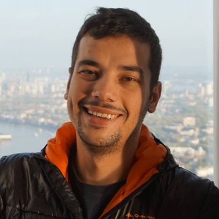

  

<h1 align="center">Vlad Dulgheru</h1>

<b>Full Stack Software Engineer — Java &amp; Spring Boot Backend</b> 
9+ years building telecom and enterprise software. 
Bucharest, Romania · open to remote (Europe)

  
  
  

## 🔧 What I work on

- **[Ceragon Networks](https://www.ceragon.com)** — Java Technical Lead on real-time telecom platforms: Java/Spring Boot services, PostgreSQL, Elasticsearch, Kafka, REST APIs; led CI/CD migration to OpenShift with Jenkins, TeamCity, and Dynatrace observability
- **AI-assisted engineering** — internal agents for security auditing, code review, and JUnit test generation running on local models, plus Jenkins pipeline automation
- **[This site](https://github.com/d-vlad/d-vlad.github.com)** — personal CV & portfolio, built with Hugo (Toha theme)

## 🛠️ Stack

  

## 📊 GitHub

  

## 📞 Contact

Reach me by [email](mailto:dulgheruvladut@gmail.com) or connect on [LinkedIn](https://www.linkedin.com/in/dulgheruvlad).
